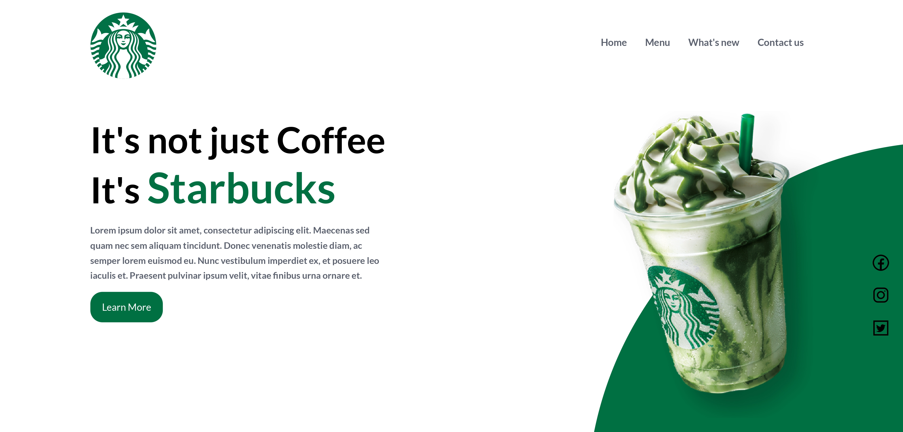

## ☕ Starbucks Landing Page ☕

### 📄 Resumo do Projeto 📄

Criei uma landing page inspirada no Starbucks.

### 🚀 Apresentação do Projeto 🚀

<a target="_blank" href="https://www.linkedin.com/posts/milton-salgado-0630a1215_html-css-dev-activity-6943735906465943552-_VAx?utm_source=linkedin_share&utm_medium=member_desktop_web">Link para a Apresentação do Projeto<a>

### 🖼️ Prévia do Projeto 🖼️

  

### 📖 Descrição do Projeto 📖

Esse projeto apresenta uma página de divulgação da marca Starbucks feita em HTML e CSS, com alguns pequenos toques de HTML5 e CSS3. 

O projeto marca meu recomeço com Desenvolvimento Web, e portanto não possui responsividade no design.
Em breve realizarei um update para colocá-lo com uma ótima responsividade!

### 🛠️ Tecnologias aprendidas e utilizadas 🛠️

  
  

Agradeço a sua atenção e leitura deste documento!

Atenciosamente, 

Milton Salgado ⚡